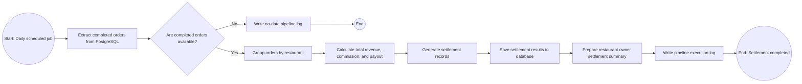

# BPMN Diagram: Daily Restaurant Settlement Pipeline

## Description

This BPMN-style diagram represents the daily restaurant settlement pipeline. The pipeline starts as a scheduled batch job. It extracts completed orders from PostgreSQL, validates whether there is data to process, groups orders by restaurant, calculates revenue and payout values, stores settlement results, and writes execution logs. If no completed orders are found, the pipeline records a no-data log and finishes without generating settlement records.