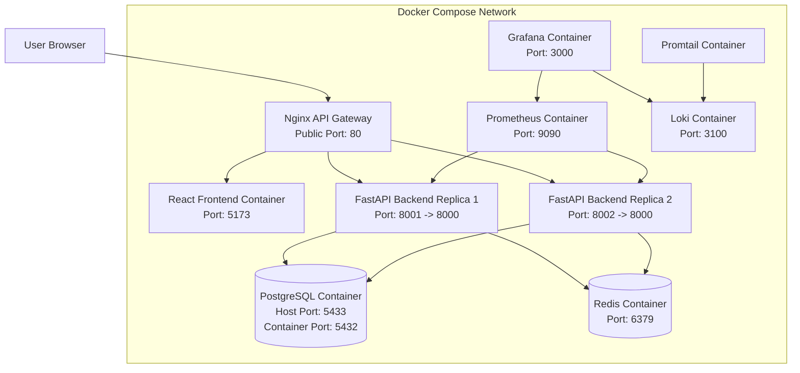

# Docker Infrastructure Diagram

## Description

This diagram shows the Docker Compose infrastructure of the food-delivery marketplace. The system is started with Docker Compose and contains frontend, backend replicas, database, cache, gateway, and observability containers. Nginx is used as the single public entry point on port 80. It routes frontend, REST API, and WebSocket traffic. PostgreSQL uses host port 5433 because port 5432 was occupied on the local machine, while inside Docker it still uses port 5432.