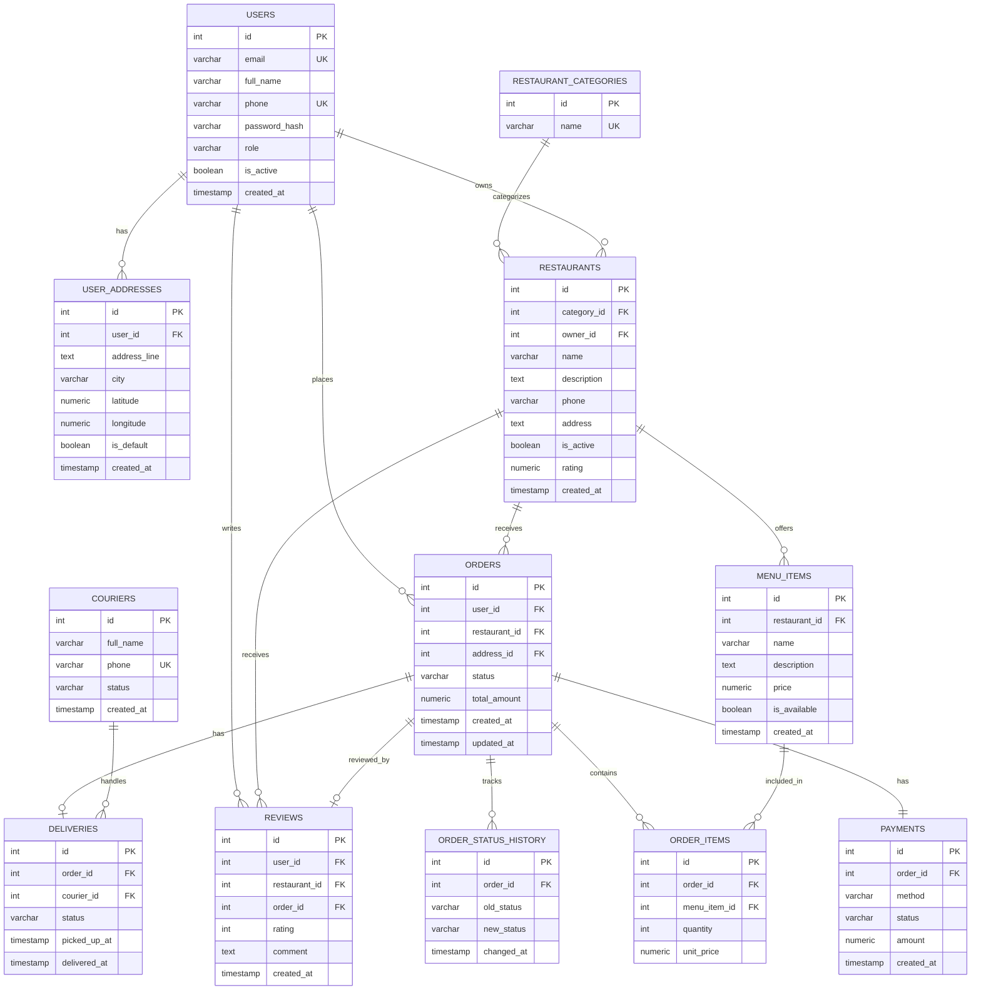

# ER Diagram

This ER diagram represents the main entities and relationships of the food-delivery marketplace database.

## Relationship Explanation

| Relationship | Type | Explanation |
|---|---|---|
| users → user_addresses | One-to-Many | One customer can store multiple delivery addresses. |
| users → orders | One-to-Many | One customer can place multiple orders. |
| users → restaurants | One-to-Many | One restaurant owner can manage multiple restaurants. |
| restaurant_categories → restaurants | One-to-Many | One category can include many restaurants. |
| restaurants → menu_items | One-to-Many | One restaurant can offer many menu items. |
| restaurants → orders | One-to-Many | One restaurant can receive many orders. |
| orders → order_items | One-to-Many | One order can contain multiple food items. |
| menu_items → order_items | One-to-Many | One menu item can appear in many orders. |
| orders → payments | One-to-One | One order has one payment record. |
| orders → deliveries | One-to-Zero-or-One | One order may have one delivery record. |
| couriers → deliveries | One-to-Many | One courier can handle many deliveries. |
| orders → order_status_history | One-to-Many | One order can have many status updates. |
| users → reviews | One-to-Many | One user can write many reviews. |
| restaurants → reviews | One-to-Many | One restaurant can receive many reviews. |
| orders → reviews | One-to-Zero-or-One | One completed order can have one review. |

## Notes

The design separates orders and order items to support multiple menu items in a single order.  
The payment, delivery, and review tables are separated from orders to keep the schema normalized.  
The order_status_history table is used for tracking and auditing status changes during the order lifecycle.