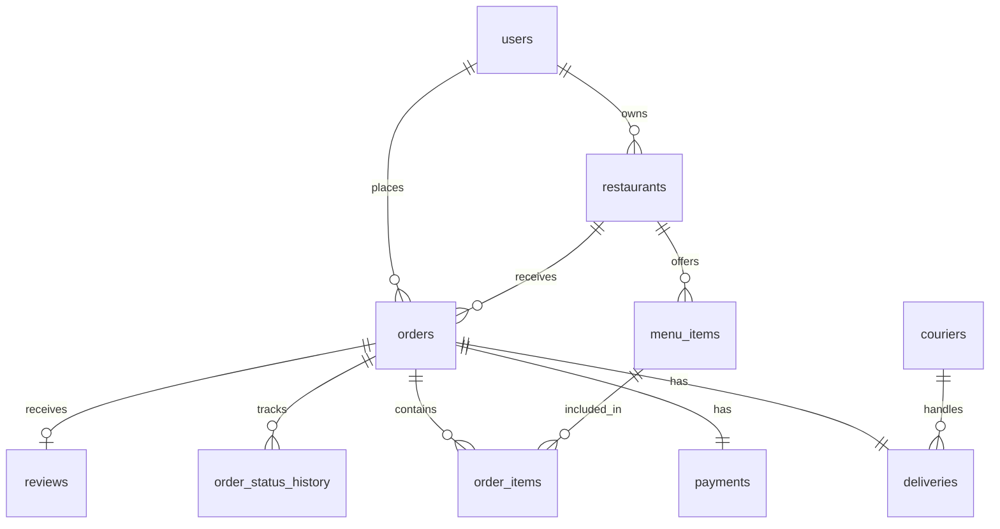
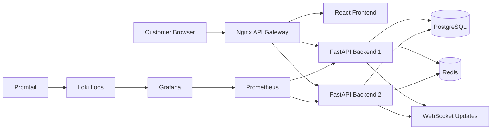
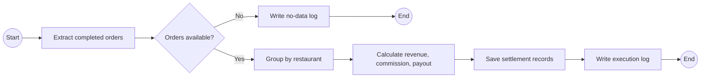

# Food-Delivery Marketplace  
## Final Project Report

**Course:** Database Application and Design  
**Project:** Food-Delivery Marketplace  
**Team Name:** Food Delivery Marketplace Team  
**Motto:** Delivering food, data, and reliability in one platform.  
**GitHub Repository:** https://github.com/Numusohandsome/food-delivery-marketplace  
**Deployed URL:** Local Docker Compose deployment: http://localhost  
**Date:** May 2026  

---

## Team Members

| Student Name | Student ID | Role |
|---|---|---|
| Maxsetov Salamat | TBD | Frontend + Report |
| Team Member 2 | TBD | Backend Core |
| Team Member 3 | TBD | Database + Cache |
| Team Member 4 | TBD | Docker Infrastructure + Observability |

---

# 1. Abstract

This project implements a food-delivery marketplace as a full-stack database application. The system connects customers, restaurants, couriers, and backend services. Customers can browse restaurants, view menus, add items to a cart, create orders, and track order status updates in real time.

The application uses React and Vite for the frontend, FastAPI for the backend, PostgreSQL as the main relational database, Redis as an additional data store and cache, WebSocket for live order updates, and Docker Compose for container orchestration. Nginx is used as the API Gateway and single public entry point. The infrastructure also includes Prometheus, Grafana, Loki, and Promtail for observability.

The project demonstrates database schema design, REST API design, WebSocket communication, Redis cache planning, a daily restaurant settlement batch pipeline, a from-scratch Token Bucket Rate Limiter, Docker infrastructure, monitoring, logging, diagrams, screenshots, and final documentation.

---

# 2. Business Scenario and Requirements

## 2.1 Scenario

The selected business scenario is a food-delivery marketplace. Customers use the platform to order food from restaurants. Restaurants provide menus and prepare orders. Couriers deliver orders. The platform manages order status, delivery tracking, payment records, database storage, caching, monitoring, and logs.

Main customer flow:

```text
Open marketplace
→ Browse restaurants
→ View menu
→ Add items to cart
→ Create order
→ Track order status
→ Receive WebSocket updates
```

Supported order statuses:

```text
created → confirmed → preparing → picked_up → delivered
```

## 2.2 Actors and Use Cases

| Use Case | Actor | Primary Flow |
|---|---|---|
| Browse restaurants | Customer | Customer opens the frontend, the frontend calls the restaurant API, and restaurants are displayed. |
| View menu | Customer | Customer selects a restaurant, the frontend requests menu items, and menu items are shown. |
| Create order | Customer | Customer adds items to cart and sends an order creation request. |
| Track order status | Customer | Customer opens the order status page and views the current order state. |
| Receive live updates | Customer | Frontend opens WebSocket connection and updates status without page refresh. |

## 2.3 Requirements Summary

| Type | Requirement | Implementation |
|---|---|---|
| Functional | Display restaurants and menus | React pages and REST API endpoints. |
| Functional | Create and track orders | Cart page, order API, and order status page. |
| Functional | Live order updates | WebSocket endpoint and frontend connection. |
| Functional | Store structured data | PostgreSQL schema with relationships and constraints. |
| Functional | Use additional data store | Redis cache design. |
| Functional | Run as containers | Docker Compose configuration. |
| Functional | Monitor system | Prometheus, Grafana, Loki, Promtail. |
| Non-functional | Maintainability | Separate frontend, backend, database, infrastructure, and docs. |
| Non-functional | Scalability | Two FastAPI backend replicas behind Nginx. |
| Non-functional | Security | Environment variables, API gateway, input validation, and rate limiting. |
| Non-functional | Availability | Docker Compose runs all required services consistently. |

The system is designed as a course-level prototype. It assumes tens to hundreds of restaurants, hundreds to thousands of menu items, and several simultaneous demo users. Local latency targets are under 1 second for restaurant/menu loading, under 2 seconds for order creation, and near real-time delivery for WebSocket status updates.

---

# 3. Domain Model and ER Diagram

The database model represents the main objects of a food-delivery marketplace: users, addresses, restaurant categories, restaurants, menu items, orders, order items, payments, couriers, deliveries, order status history, and reviews.

| Entity | Purpose |
|---|---|
| users | Stores customers, owners, couriers, and admins. |
| restaurants | Stores restaurant data and owner/category links. |
| menu_items | Stores food items, prices, and availability. |
| orders | Stores customer orders and current status. |
| order_items | Stores menu items inside orders. |
| payments | Stores payment method, status, and amount. |
| couriers | Stores courier profiles and availability. |
| deliveries | Stores courier assignment and delivery status. |
| order_status_history | Stores historical status changes. |
| reviews | Stores customer ratings and comments. |

Main relationships:

| Relationship | Type |
|---|---|
| user → orders | One-to-many |
| restaurant → menu_items | One-to-many |
| restaurant → orders | One-to-many |
| order → order_items | One-to-many |
| order → payment | One-to-one |
| order → delivery | One-to-one |
| order → order_status_history | One-to-many |
| courier → deliveries | One-to-many |



The schema uses primary keys, foreign keys, unique constraints, check constraints, and not-null constraints. Alembic migrations were used to create and update the database schema. Seed data was added to support testing and demonstration.

---

# 4. System Architecture

The system follows a containerized full-stack architecture. The user accesses the React frontend through Nginx. Nginx routes REST API and WebSocket traffic to FastAPI backend replicas. The backend uses PostgreSQL for persistent relational data and Redis for caching or fast access. Prometheus, Grafana, Loki, and Promtail provide observability.



Main request flow:

```text
Browser → Nginx Gateway → FastAPI Backend → PostgreSQL/Redis → Response
```

WebSocket flow:

```text
Order Status Page → Nginx Gateway → Backend WebSocket → Live status update
```

---

# 5. API Design

The backend provides REST API endpoints for standard operations and WebSocket for live order updates.

| Method | Endpoint | Purpose |
|---|---|---|
| GET | `/api/restaurants` | Returns restaurant list. |
| GET | `/api/restaurants/{restaurant_id}/menu` | Returns menu items for a restaurant. |
| POST | `/api/orders` | Creates a new order. |
| GET | `/api/orders/{order_id}` | Returns order details and current status. |
| PATCH | `/api/orders/{order_id}/status` | Updates order status. |
| WS | `/ws/orders/{order_id}` | Sends live order status updates. |

Example order creation request:

```json
{
  "restaurant_id": 1,
  "customer_id": 1,
  "delivery_address": "Demo address, Tashkent",
  "total_price": 19.98,
  "items": [
    {
      "menu_item_id": 101,
      "quantity": 1
    }
  ]
}
```

The frontend uses:

```text
REST API base URL: http://localhost/api
WebSocket base URL: ws://localhost/ws
```

The WebSocket connection is shown on the order status page. During testing, the page displayed `WebSocket: connected`.

---

# 6. Data-Layer Design

The data layer uses PostgreSQL, SQLAlchemy, Alembic migrations, and Redis cache design.

PostgreSQL stores structured business data. SQLAlchemy models represent database tables in the backend. Alembic migrations version the schema. Redis is used as an additional data store and cache layer.

Important data-layer features:

| Feature | Description |
|---|---|
| Relational schema | Represents users, restaurants, menus, orders, payments, deliveries, and reviews. |
| Migrations | Alembic migrations create tables, indexes, and seed data. |
| Seed data | Demo users, restaurants, menu items, and orders support testing. |
| Constraints | Primary keys, foreign keys, check constraints, and unique constraints protect data integrity. |
| Indexes | Improve restaurant search, menu lookup, order history, and status tracking. |
| Redis cache | Planned for restaurant lists, menus, order status, and rate limiter counters. |

Example Redis key patterns:

| Key | Purpose |
|---|---|
| `restaurants:active` | Cache active restaurants. |
| `restaurant:{id}:menu` | Cache restaurant menu. |
| `order:{id}:status` | Cache order status. |
| `rate_limit:{client_id}` | Store rate limiter state. |

---

# 7. Batch Pipeline

The project includes a daily restaurant settlement batch pipeline. Its purpose is to process completed orders and calculate restaurant revenue, platform commission, and final payout.



Pipeline steps:

| Step | Description |
|---|---|
| Extract completed orders | Select delivered/completed orders from PostgreSQL. |
| Validate data | Check if there are orders to process. |
| Group by restaurant | Aggregate orders per restaurant. |
| Calculate settlement | Compute gross revenue, commission, and net payout. |
| Save results | Store settlement results. |
| Write logs | Record pipeline execution status. |

Future improvements include a real scheduler, audit records, tax/refund logic, and integration with payment providers.

---

# 8. From-Scratch Component: Token Bucket Rate Limiter

The from-scratch component is a Token Bucket Rate Limiter. It protects the backend from excessive requests by limiting how often a client can call the API.

Algorithm summary:

```text
Each client has a bucket.
The bucket has a maximum capacity.
Tokens refill over time.
Each request consumes one token.
If tokens are available, the request is allowed.
If no tokens are available, the request is blocked.
```

Benefits:

| Benefit | Description |
|---|---|
| Protects backend | Reduces excessive request traffic. |
| Allows bursts | Normal short bursts are still allowed. |
| Simple and efficient | Easy to implement and test. |
| Reusable | Can be applied to multiple endpoints. |

Production improvements would include Redis-backed token storage, HTTP 429 responses, per-route limits, metrics, and configurable refill rates.

---

# 9. Infrastructure and Deployment

The infrastructure is based on Docker Compose. It includes frontend, backend replicas, database, cache, gateway, and observability containers.

| Service | Technology | Purpose |
|---|---|---|
| frontend | React + Vite | Customer user interface. |
| backend1/backend2 | FastAPI | REST API and WebSocket logic. |
| nginx | Nginx | API Gateway and public entry point. |
| postgres | PostgreSQL | Main relational database. |
| redis | Redis | Cache and additional data store. |
| prometheus | Prometheus | Metrics collection. |
| grafana | Grafana | Dashboard visualization. |
| loki/promtail | Loki + Promtail | Log storage and forwarding. |

Commands used:

```bash
docker compose down
docker compose up -d --build
docker compose ps
```

The system is accessed through:

```text
http://localhost
```

PostgreSQL uses host port `5433` because port `5432` was occupied locally. Inside Docker it still uses port `5432`, so internal service communication remains unchanged.

---

# 10. Observability

The observability stack includes Prometheus, Grafana, Loki, and Promtail.

| Tool | Purpose |
|---|---|
| Prometheus | Collects metrics and target status. |
| Grafana | Displays dashboards and logs. |
| Loki | Stores logs. |
| Promtail | Forwards container logs to Loki. |

The project includes screenshots for Prometheus targets, Grafana dashboard, Loki logs, Docker containers, and gateway frontend access. These screenshots provide evidence that observability and integration were configured and tested.

Limitations include basic dashboards, limited custom application metrics, no alerting, and no distributed tracing. Future work could add API latency dashboards, structured JSON logs, request IDs, and alerts.

---

# 11. Frontend Implementation

The frontend was implemented using React and Vite. It provides the main customer flow:

```text
Restaurant list → Menu page → Cart page → Create order → Order status page
```

Frontend pages:

| Page | Purpose |
|---|---|
| Restaurant List Page | Shows restaurants. |
| Menu Page | Shows food items for a selected restaurant. |
| Cart Page | Shows selected items and total price. |
| Order Status Page | Shows order status and WebSocket connection. |

The frontend uses an API client for REST calls and a WebSocket client for live updates. Mock data is kept as fallback so the frontend can still work if backend endpoints are temporarily unavailable.

Frontend screenshots are stored in:

```text
docs/screenshots/frontend/
```

The most important screenshot for R7 is:

```text
docs/screenshots/frontend/05-websocket-connected.png
```

It shows `WebSocket: connected`.

---

# 12. Testing and Known Limitations

Testing was completed through local development and Docker Compose.

Tested flow:

```text
Open http://localhost
→ View restaurant list
→ Open menu
→ Add item to cart
→ Create order
→ Open order status page
→ Confirm WebSocket connected
→ Move order to next status
```

Evidence screenshots include frontend flow, Docker containers, gateway checks, backend API verification, Prometheus, Grafana, and Loki logs.

Known limitations:

| Limitation | Future Improvement |
|---|---|
| Simple frontend UI | Improve responsiveness and design. |
| Demo users | Add full authentication and roles. |
| Local cart storage | Store carts in backend sessions. |
| Single PostgreSQL container | Use managed PostgreSQL or replication. |
| Single Redis container | Use managed Redis or Redis cluster. |
| Local Docker deployment | Deploy to VPS/cloud with HTTPS. |
| Basic observability | Add alerts, custom metrics, and tracing. |

---

# 13. Team Contribution Table

| Team Member | Role | Completed Contributions |
|---|---|---|
| Maxsetov Salamat | Frontend + Report | Implemented restaurant list, menu page, cart page, order creation flow, order status page, WebSocket frontend integration, screenshots, diagrams, and report sections. |
| Team Member 2 | Backend Core | Implemented FastAPI endpoints, WebSocket backend logic, order status updates, and Token Bucket Rate Limiter. |
| Team Member 3 | Database + Cache | Designed PostgreSQL schema, Alembic migrations, seed data, indexes, query optimization, and Redis cache design. |
| Team Member 4 | Docker Infrastructure + Observability | Configured Docker Compose, Nginx gateway, backend replicas, Prometheus, Grafana, Loki, Promtail, and infrastructure screenshots. |

---

# 14. References

1. FastAPI Documentation.
2. React Documentation.
3. Vite Documentation.
4. PostgreSQL Documentation.
5. SQLAlchemy Documentation.
6. Alembic Documentation.
7. Redis Documentation.
8. Docker Documentation.
9. Docker Compose Documentation.
10. Nginx Documentation.
11. Prometheus Documentation.
12. Grafana Documentation.
13. Loki and Promtail Documentation.
14. Mermaid Documentation.

---

# Appendix A. Evidence Screenshots

Important screenshots are stored in the repository:

| Screenshot Type | Location |
|---|---|
| Frontend flow screenshots | `docs/screenshots/frontend/` |
| Integration screenshots | `docs/screenshots/integration/` |
| Docker containers | `docs/screenshots/docker-containers.png` |
| Gateway frontend | `docs/screenshots/gateway-frontend.png` |
| Grafana dashboard | `docs/screenshots/grafana-dashboard.png` |
| Prometheus targets | `docs/screenshots/prometheus-targets.png` |
| Loki logs | `docs/screenshots/loki-logs.png` |

---

# Appendix B. Diagrams

| Diagram | Location |
|---|---|
| System architecture | `docs/diagrams/system_architecture.md` |
| Docker infrastructure | `docs/diagrams/docker_infrastructure.md` |
| BPMN batch settlement pipeline | `docs/diagrams/batch_settlement_bpmn.md` |
| ER diagram | `docs/er_diagram.md` |

---

# Final Conclusion

The food-delivery marketplace project demonstrates a complete full-stack database application. It includes frontend pages, backend REST APIs, PostgreSQL schema design, Redis cache planning, WebSocket live updates, Docker Compose infrastructure, Nginx gateway routing, observability tools, a batch settlement pipeline, and a from-scratch Token Bucket Rate Limiter.

The final system was tested through Docker Compose and accessed through `http://localhost`. The main customer flow worked successfully, and the order status page showed `WebSocket: connected`. The project is suitable as a course-level prototype and provides a strong foundation for future production improvements.
